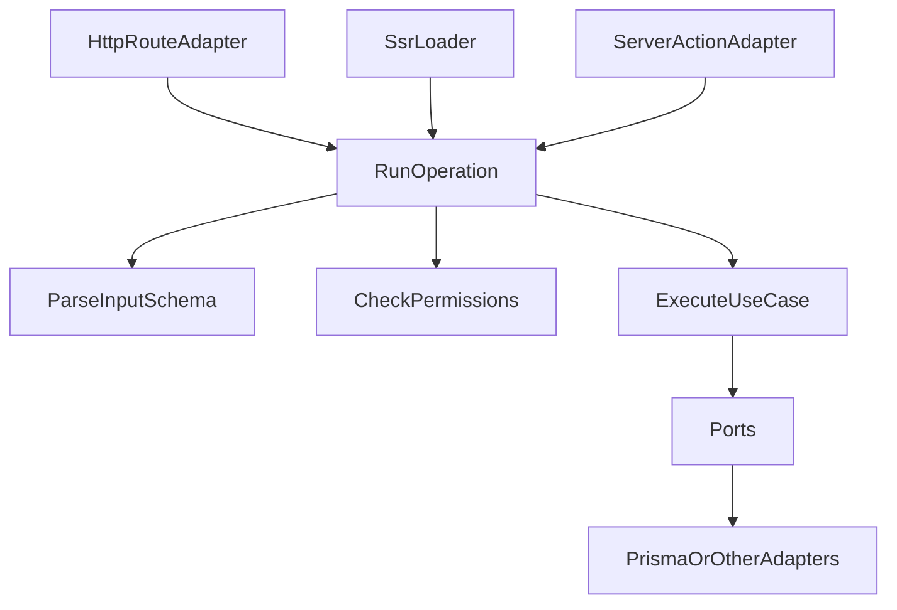

# Unified Operations Architecture

This project uses an operation-centric architecture to keep validation and authorization rules in one place and reuse them across transports.

## Core rule

Business operations own:

- input schema
- required permissions
- use-case handler

Transports only adapt I/O:

- HTTP route adapters
- SSR loaders
- server actions

No transport should declare permissions or operation input schema for a migrated operation.

## Flow

## Shared primitives

- `features/shared/application/operation.ts`
- `features/shared/application/run-operation.ts`
- `features/shared/application/errors/operation-errors.ts`
- `features/shared/adapters/http/map-operation-error-to-response.ts`
- `features/shared/adapters/action/map-operation-error-to-action-result.ts`

## Auth context

Auth context is resolved in transport adapters and passed into `runOperation`.

- HTTP: `withAuthContext`
- SSR/server actions: `requireSsrAuth([])` then operation-level permission check in `runOperation`

## Golden path for a new feature operation

1. Add `features/<feature>/application/operations/<name>.operation.ts`.
2. Define schema + required permissions in that operation.
3. Inject ports/dependencies into operation builder.
4. Call the operation from route/action/SSR via `runOperation`.
5. Map errors at transport edge only.
6. Add operation tests and adapter mapping tests.
